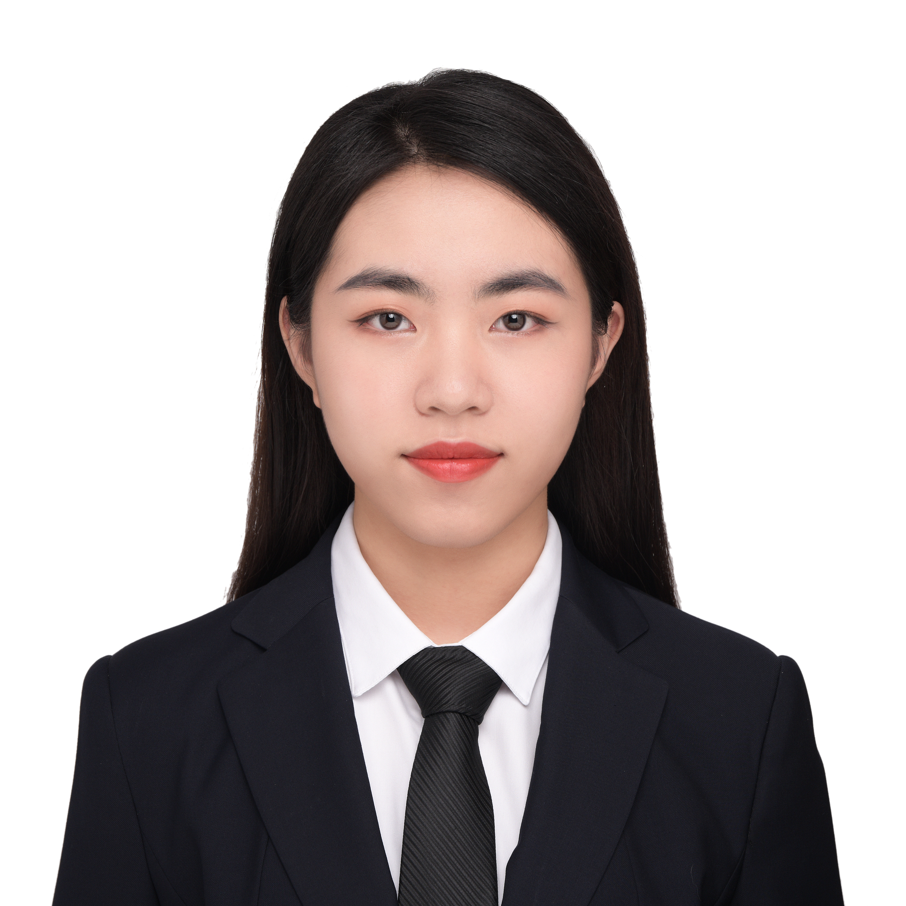

# Jiayi Zhao (Viki) 

## [EDUCATION](#education)
  **Major:** Mathmathics-Computer Science and Cognitive Science Spec. in Machine Learning and Neural Computation (Bachelor of Science)
  **Relevant Coursework:**
  1. CSE 100: Data Structures and Object-Oriented Design (C++ & Java)
  2. CSE 101: Math/Algorithm & Systems Analysis
  3. COGS 108: Data Science in Practice (Python)

## [TECHINCAL SKILLS](#techincal-skills)
**Languages:**
- Python (SciPy, Numpy, Pandas, Patsy)
- MATLAB
- C
- C++
- Java
- HTML/CSS
- JavaScript

**Data Visualization:**
- Matplotlib
- Seaborn
- Powerpoint
- LaTeX

**English / Mandarin Bilingual**

## [ABOUT ME](#about-me)
**Favorite sentence**
> Start Early, Start Often

**Favorite Codes:**
``print(“Hello World”)``

**Recent Favorite Meme**

**More About Me Please Go To My [Personal Website](https://vikizzz.github.io)**

## [Stuff to Learn in CSE 110](#stuff-to-learn-in-cse-110)
- [ ] Intros, Logistics, Class Goals, Foundational Material, Motivation, Individual Management, Groups
- [ ] Group Dynamics, "Practicing",  Team Formation (Initial Tech Skills, Initial Social Skills), Project Setup
- [ ] User-Centered Thinking & Design - User Stories and Design
- [ ] Process Models - Theory and Practice - Planning, Requirements, and Diagramming
- [ ] Interfaces and Patterns - Wireframe and Design
- [ ] Writing Code 
- [ ] Building and Managing Projects
- [ ] Testing 
- [ ] DevOps
- [ ] The Secret Life of Software, Class Retro
- [ ] Project Presentation Party

### Back to the [Home](README.md) page